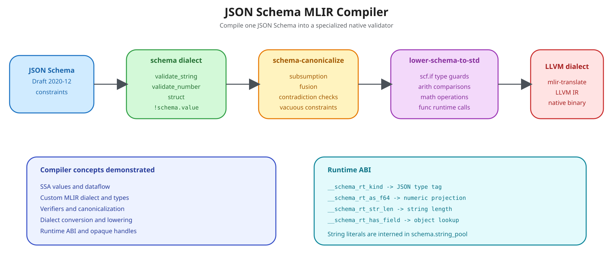

# json-schema-mlir

An out-of-tree [MLIR](https://mlir.llvm.org) dialect that compiles **JSON Schema**
(Draft 2020-12) documents into optimized native validators.

Validation rules are first raised into a dedicated `schema` dialect where they can
be reasoned about _as constraints_ — subsumption, fusion, contradiction detection —
and only then lowered to `arith`/`scf`/`math` and on to LLVM IR. The result is a
branch-minimal validator specialized to one schema, rather than a generic
interpreter walking a rule tree at runtime.



[Edit the overview diagram in Excalidraw](json-schema-mlir-overview.excalidraw)

---

## Pipeline

```
  schema.json
      │  front end (schema -> IR)
      ▼
┌─────────────────────────────────────────────────────────────────┐
│  schema dialect                                                 │
│    schema.validate_string / schema.validate_number              │
│    schema.struct                    types: !schema.value        │
└─────────────────────────────────────────────────────────────────┘
      │  --schema-canonicalize
      │    · constraint-lattice subsumption  (min_length 5 ⊑ 2)
      │    · conjunction fusion              (n ops -> 1 op)
      │    · vacuous-constraint elimination
      ▼
┌─────────────────────────────────────────────────────────────────┐
│  schema dialect (normal form) — one validation op per SSA input │
└─────────────────────────────────────────────────────────────────┘
      │  --lower-schema-to-std
      │    · TypeConverter: !schema.value -> i64 (opaque RT handle)
      │    · type guard   -> arith.cmpi + scf.if
      │    · bounds       -> arith.cmpf oge/ogt/ole/olt
      │    · integrality  -> math.trunc / math.roundeven
      │    · strings/objects -> func.call @__schema_rt_*
      ▼
┌─────────────────────────────────────────────────────────────────┐
│  arith · scf · math · func                                      │
└─────────────────────────────────────────────────────────────────┘
      │  --schema-to-llvm-pipeline
      │    (convert-scf-to-cf, convert-to-llvm, reconcile-casts)
      ▼
┌─────────────────────────────────────────────────────────────────┐
│  LLVM dialect  ──mlir-translate──▶  LLVM IR  ──▶  native object │
└─────────────────────────────────────────────────────────────────┘
```

### Why an `scf.if`, not a flat conjunction

A JSON Schema type assertion applied to a value of the wrong type must evaluate to
`false` — it must **not** execute the projection. Every lowered validator is
therefore guarded on the runtime type tag:

```mlir
%kind  = func.call @__schema_rt_kind(%doc) : (i64) -> i32
%isnum = arith.cmpi eq, %kind, %c2_i32 : i32
%ok    = scf.if %isnum -> (i1) {
           %x  = func.call @__schema_rt_as_f64(%doc) : (i64) -> f64
           %ge = arith.cmpf oge, %x, %cst_0 : f64
           scf.yield %ge : i1
         } else {
           scf.yield %false : i1
         }
```

### Runtime ABI

The lowered module calls a small, side-effect-free shim. All entry points take an
opaque `i64` document handle; string literals are interned into the module-level
`schema.string_pool` attribute and referenced by index.

| Symbol                    | Signature          | Purpose                               |
| ------------------------- | ------------------ | ------------------------------------- |
| `__schema_rt_kind`        | `(i64) -> i32`     | JSON type tag (`0`=null … `5`=object) |
| `__schema_rt_as_f64`      | `(i64) -> f64`     | Numeric projection                    |
| `__schema_rt_str_len`     | `(i64) -> i64`     | Code-point length                     |
| `__schema_rt_str_matches` | `(i64, i64) -> i1` | Regex match by pool index             |
| `__schema_rt_str_format`  | `(i64, i64) -> i1` | `format` assertion by pool index      |
| `__schema_rt_has_field`   | `(i64, i64) -> i1` | Object member presence                |

---

## Building

Requires **CMake ≥ 3.20**, **Ninja**, a **C++20** compiler, and an LLVM/MLIR
install (19 or newer) built with `-DLLVM_INSTALL_UTILS=ON` so that `FileCheck`
and `llvm-lit` are available.

```bash
# Point at the cmake package directories of your LLVM/MLIR install.
export MLIR_INSTALL=/path/to/llvm-install

cmake -G Ninja -B build                                    \
      -DMLIR_DIR="${MLIR_INSTALL}/lib/cmake/mlir"          \
      -DLLVM_DIR="${MLIR_INSTALL}/lib/cmake/llvm"          \
      -DLLVM_EXTERNAL_LIT="${MLIR_INSTALL}/bin/llvm-lit"   \
      -DCMAKE_BUILD_TYPE=Release                           \
      -DCMAKE_C_COMPILER=clang                             \
      -DCMAKE_CXX_COMPILER=clang++                         \
      -DCMAKE_EXPORT_COMPILE_COMMANDS=ON

ninja -C build schema-opt
```

`-DMLIR_DIR` is the only strictly required cache entry — `MLIRConfig.cmake`
re-exports `LLVM_DIR`, the TableGen executable path, and the include/library
directories. Set `LLVM_DIR` explicitly only when the two live in separate prefixes.

> **RTTI/EH.** Upstream LLVM defaults to `LLVM_ENABLE_RTTI=OFF`; `AddMLIR`
> propagates `-fno-rtti`, so the project uses `llvm::dyn_cast` / `TypeSwitch`
> throughout and never `dynamic_cast`.

---

## Testing

```bash
# Full regression suite (builds dependencies first).
ninja -C build check-schema

# Or drive llvm-lit directly, with verbose failure output.
"${MLIR_INSTALL}/bin/llvm-lit" -v build/test

# A single directory or file.
"${MLIR_INSTALL}/bin/llvm-lit" -v build/test/Lowering
"${MLIR_INSTALL}/bin/llvm-lit" -v --filter=lower-to-std build/test
```

Inspect a transformation by hand:

```bash
# Constraint-lattice canonicalization, with statistics.
./build/bin/schema-opt test/Dialect/Schema/schema-canonicalize.mlir \
    --schema-canonicalize --split-input-file --mlir-pass-statistics

# Lowering to standard dialects.
./build/bin/schema-opt test/Lowering/lower-to-std.mlir \
    --lower-schema-to-std --split-input-file

# All the way to LLVM IR.
./build/bin/schema-opt test/Lowering/lower-to-std.mlir \
    --schema-to-llvm-pipeline |
  "${MLIR_INSTALL}/bin/mlir-translate" --mlir-to-llvmir
```

---

## Pass reference

| Flag                        | Scope            | Description                                                                       |
| --------------------------- | ---------------- | --------------------------------------------------------------------------------- |
| `--schema-canonicalize`     | `func.func`      | Constraint-lattice subsumption, conjunction fusion, vacuous-attribute elimination |
| `--lower-schema-to-std`     | `builtin.module` | Full dialect conversion to `arith`/`scf`/`math`/`func`                            |
| `--schema-to-std-pipeline`  | `builtin.module` | Canonicalize → lower → reconcile-casts → CSE → symbol-DCE                         |
| `--schema-to-llvm-pipeline` | `builtin.module` | The above, plus `convert-scf-to-cf` and `convert-to-llvm`                         |

---

## Repository layout

```
include/Schema/     ODS definitions (.td), public headers, pass interfaces
lib/Schema/         Dialect registration, verifiers, canonicalizer, lowering
tools/schema-opt/   mlir-opt-style driver
test/Dialect/       Round-trip, verifier and canonicalization tests
test/Lowering/      Dialect-conversion FileCheck tests
```

## License

Apache-2.0 WITH LLVM-exception, matching upstream LLVM.
