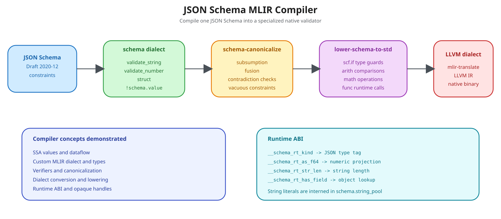

# json-schema-mlir 📐

An out-of-tree [MLIR](https://mlir.llvm.org) dialect that compiles **JSON Schema**
(Draft 2020-12) documents into optimized native validators.

Validation rules are first raised into a dedicated `schema` dialect where they can
be reasoned about _as constraints_ — subsumption, fusion, contradiction detection —
and only then lowered to `arith`/`scf`/`math` and on to LLVM IR. The result is a
branch-minimal validator specialized to one schema, rather than a generic
interpreter walking a rule tree at runtime.



[Edit the overview diagram in Excalidraw](json-schema-mlir-overview.excalidraw)

---

## 🛤️ Pipeline

```
  schema.json
      │  schema-translate --import-json-schema
      │    · lexer     -> tokens            (--dump-tokens)
      │    · parser    -> schema AST        (--dump-ast)
      │    · importer  -> one op per keyword, located at the keyword
      ▼
┌─────────────────────────────────────────────────────────────────┐
│  schema dialect                                                 │
│    schema.validate_string / schema.validate_number              │
│    schema.struct                    types: !schema.value        │
└─────────────────────────────────────────────────────────────────┘
      │  --schema-canonicalize
      │    · constraint-lattice subsumption  (min_length 5 ⊑ 2)
      │    · conjunction fusion              (n ops -> 1 op)
      │    · vacuous-constraint elimination
      ▼
┌─────────────────────────────────────────────────────────────────┐
│  schema dialect (normal form) — one validation op per SSA input │
└─────────────────────────────────────────────────────────────────┘
      │  --lower-schema-to-std
      │    · TypeConverter: !schema.value -> i64 (opaque RT handle)
      │    · type guard   -> arith.cmpi + scf.if
      │    · bounds       -> arith.cmpf oge/ogt/ole/olt
      │    · integrality  -> math.trunc / math.roundeven
      │    · strings/objects -> func.call @__schema_rt_*
      ▼
┌─────────────────────────────────────────────────────────────────┐
│  arith · scf · math · func                                      │
└─────────────────────────────────────────────────────────────────┘
      │  --schema-to-llvm-pipeline
      │    (convert-scf-to-cf, convert-to-llvm, reconcile-casts)
      ▼
┌─────────────────────────────────────────────────────────────────┐
│  LLVM dialect  ──mlir-translate──▶  LLVM IR  ──▶  native object │
└─────────────────────────────────────────────────────────────────┘
```

### 💡 Why an `scf.if`, not a flat conjunction

A JSON Schema type assertion applied to a value of the wrong type must evaluate to
`false` — it must **not** execute the projection. Every lowered validator is
therefore guarded on the runtime type tag:

```mlir
%kind  = func.call @__schema_rt_kind(%doc) : (i64) -> i32
%isnum = arith.cmpi eq, %kind, %c2_i32 : i32
%ok    = scf.if %isnum -> (i1) {
           %x  = func.call @__schema_rt_as_f64(%doc) : (i64) -> f64
           %ge = arith.cmpf oge, %x, %cst_0 : f64
           scf.yield %ge : i1
         } else {
           scf.yield %false : i1
         }
```

### 🔌 Runtime ABI

The lowered module calls a small, side-effect-free shim. All entry points take an
opaque `i64` document handle; string literals are interned into the module-level
`schema.string_pool` attribute and referenced by index.

| Symbol                    | Signature          | Purpose                               |
| ------------------------- | ------------------ | ------------------------------------- |
| `__schema_rt_kind`        | `(i64) -> i32`     | JSON type tag (`0`=null … `5`=object) |
| `__schema_rt_as_f64`      | `(i64) -> f64`     | Numeric projection                    |
| `__schema_rt_str_len`     | `(i64) -> i64`     | Code-point length                     |
| `__schema_rt_str_matches` | `(i64, i64) -> i1` | Regex match by pool index             |
| `__schema_rt_str_format`  | `(i64, i64) -> i1` | `format` assertion by pool index      |
| `__schema_rt_has_field`   | `(i64, i64) -> i1` | Object member presence                |

---

## 🧩 Front end

`schema-translate` imports a JSON Schema document into the `schema` dialect.
It is a separate tool from `schema-opt` because, as with
`mlir-translate --import-llvm`, its input is not MLIR:

```bash
build/bin/schema-translate --import-json-schema examples/person/person.schema.json |
  build/bin/schema-opt --schema-canonicalize
```

The front end runs in three stages, each of which can be printed on its own:

| Stage    | Output                                                          | Flag            |
| -------- | --------------------------------------------------------------- | --------------- |
| Lexer    | Tokens with `line:col` and byte ranges (hand-written, RFC 8259) | `--dump-tokens` |
| Parser   | Schema AST, one node per schema, property and keyword           | `--dump-ast`    |
| Importer | `func.func @validate_<title>` in the `schema` dialect           | (default)       |

`--emit-trace=<file.json>` also writes the tokens, the AST, the diagnostics,
and the IR before and after `--schema-canonicalize`, all tied to source
ranges, for an external viewer. The format is specified in
[`docs/trace-format.md`](docs/trace-format.md).

### 📑 Supported keywords

The subset of Draft 2020-12 the dialect can express:

| Keyword                                                       | IR                                                       |
| ------------------------------------------------------------- | -------------------------------------------------------- |
| `type`: `string`                                              | `schema.validate_string` (type guard only)               |
| `type`: `number` / `integer`                                  | `schema.validate_number` / `… {integral}`                |
| `type`: `object`, `properties`, `required`                    | `schema.struct`, one validator operand per property      |
| `minimum`, `maximum`                                          | `schema.validate_number {minimum}` / `{maximum}`         |
| `exclusiveMinimum`, `exclusiveMaximum`                        | The same, plus `exclusive_minimum` / `exclusive_maximum` |
| `multipleOf`                                                  | `schema.validate_number {multiple_of}`                   |
| `minLength`, `maxLength`                                      | `schema.validate_string {min_length}` / `{max_length}`   |
| `pattern`, `format`                                           | `schema.validate_string {pattern}` / `{format}`          |
| `allOf`                                                       | `arith.andi` of the branches                             |
| Annotations: `title`, `description`, `$comment`, `$schema`, … | Ignored; `title` names the function and struct           |

Anything else (`oneOf`, `items`, `enum`, `$ref`, type unions, boolean
schemas, the `array`/`boolean`/`null` types, drafts other than 2020-12) is a
located error rather than a silent approximation.

How the importer builds the IR:

- **One op per keyword.** Each op's location is the `FileLineColLoc` of its
  keyword, and a schema's conjuncts are joined with `arith.andi` located at
  the schema. `--schema-canonicalize` then fuses them and keeps every
  keyword's location in a `FusedLoc`.
- **Types come from the conjunction.** The dialect's validators check the
  JSON type as well as the constraint, so a keyword such as `minimum` needs a
  `type` on its own schema or on another branch of the same `allOf`.
  A keyword for another type (`minLength` on an integer) has no effect in
  JSON Schema; the importer drops it with a warning.
- **Signature.** `%arg0` is the document; each distinct property path
  (a JSON Pointer such as `/address/city`) adds one `!schema.value`
  argument, in depth-first declaration order.
- **Additional properties.** The importer never sets `additional_properties`
  on `schema.struct` (the lowering does not check undeclared members either
  way), and `additionalProperties` itself is not supported.
- **Semantic errors** go through `mlir::emitError` at the keyword: bounds no
  value satisfies (`minimum > maximum`, `minLength > maxLength`), a
  non-positive `multipleOf`, a `required` property missing from
  `properties`, contradicting types and invalid regular expressions.

Syntax errors are reported as `file:line:col` diagnostics, and the parser
recovers at the next `,`, `}` or `]` to report several errors in one run.
JSON has no comments, so `--allow-comments` (JSONC-style `//` and `/* */`)
exists for tests that need `// expected-error` lines with
`-verify-diagnostics`.

---

## 🔨 Building

### 📋 Prerequisites

The verified macOS setup uses the following direct dependencies:

| Dependency                    | Verified version   | Purpose                                            |
| ----------------------------- | ------------------ | -------------------------------------------------- |
| CMake                         | 4.4.3              | Configure and build the project                    |
| Ninja                         | 1.13.2             | CMake build generator                              |
| Apple Clang or Homebrew Clang | 21.0.0 / 23.1.1    | C++20 compiler                                     |
| LLVM/MLIR                     | 23.1.1             | MLIR libraries, headers, TableGen, and `FileCheck` |
| Python                        | 3.11.7             | Runs the standalone `lit` test runner              |
| `lit`                         | required on `PATH` | Runs the MLIR regression tests                     |

Install the Homebrew dependencies on macOS with:

```bash
brew install cmake ninja llvm
python3 -m pip install --user lit
```

Homebrew's LLVM is keg-only. Point the build at its CMake package directories:

```bash
export MLIR_INSTALL="$(brew --prefix llvm)"
export PATH="${MLIR_INSTALL}/bin:${PATH}"
```

Alternatively, use an LLVM/MLIR 19 or newer installation built with
`-DLLVM_INSTALL_UTILS=ON`, which provides `FileCheck` and `llvm-lit` together.

```bash
# Point at the cmake package directories of your LLVM/MLIR install.
export MLIR_INSTALL=/path/to/llvm-install

cmake -G Ninja -B build                                    \
      -DMLIR_DIR="${MLIR_INSTALL}/lib/cmake/mlir"          \
      -DLLVM_DIR="${MLIR_INSTALL}/lib/cmake/llvm"          \
      -DLLVM_EXTERNAL_LIT="${MLIR_INSTALL}/bin/llvm-lit"   \
      -DCMAKE_BUILD_TYPE=Release                           \
      -DCMAKE_C_COMPILER=clang                             \
      -DCMAKE_CXX_COMPILER=clang++                         \
      -DCMAKE_EXPORT_COMPILE_COMMANDS=ON

ninja -C build schema-opt
```

`-DMLIR_DIR` is the only strictly required cache entry — `MLIRConfig.cmake`
re-exports `LLVM_DIR`, the TableGen executable path, and the include/library
directories. Set `LLVM_DIR` explicitly only when the two live in separate prefixes.

> ⚠️ **RTTI/EH.** Upstream LLVM defaults to `LLVM_ENABLE_RTTI=OFF`; `AddMLIR`
> propagates `-fno-rtti`, so the project uses `llvm::dyn_cast` / `TypeSwitch`
> throughout and never `dynamic_cast`.

---

## 🧪 Testing

```bash
# Full regression suite (builds dependencies first).
ninja -C build check-schema

# Or drive llvm-lit directly, with verbose failure output.
"${MLIR_INSTALL}/bin/llvm-lit" -v build/test

# A single directory or file.
"${MLIR_INSTALL}/bin/llvm-lit" -v build/test/Lowering
"${MLIR_INSTALL}/bin/llvm-lit" -v --filter=lower-to-std build/test
```

Inspect a transformation by hand:

```bash
# Constraint-lattice canonicalization, with statistics.
./build/bin/schema-opt test/Dialect/Schema/schema-canonicalize.mlir \
    --schema-canonicalize --split-input-file --mlir-pass-statistics

# Lowering to standard dialects.
./build/bin/schema-opt test/Lowering/lower-to-std.mlir \
    --lower-schema-to-std --split-input-file

# Front end stages.
./build/bin/schema-translate --import-json-schema --dump-tokens examples/person/person.schema.json
./build/bin/schema-translate --import-json-schema --dump-ast examples/person/person.schema.json
./build/bin/schema-translate --import-json-schema --mlir-print-debuginfo \
    examples/person/person.schema.json --emit-trace=person.trace.json

# All the way to LLVM IR.
./build/bin/schema-opt test/Lowering/lower-to-std.mlir \
    --schema-to-llvm-pipeline |
  "${MLIR_INSTALL}/bin/mlir-translate" --mlir-to-llvmir
```

---

## 🎛️ Pass reference

| Flag                        | Scope            | Description                                                                       |
| --------------------------- | ---------------- | --------------------------------------------------------------------------------- |
| `--schema-canonicalize`     | `func.func`      | Constraint-lattice subsumption, conjunction fusion, vacuous-attribute elimination |
| `--lower-schema-to-std`     | `builtin.module` | Full dialect conversion to `arith`/`scf`/`math`/`func`                            |
| `--schema-to-std-pipeline`  | `builtin.module` | Canonicalize → lower → reconcile-casts → CSE → symbol-DCE                         |
| `--schema-to-llvm-pipeline` | `builtin.module` | The above, plus `convert-scf-to-cf` and `convert-to-llvm`                         |

---

## 🗂️ Repository layout

```
include/Schema/         ODS definitions (.td), public headers, pass interfaces
include/Schema/Import/  Front-end headers: lexer, AST, parser, importer, trace
lib/Schema/             Dialect registration, verifiers, canonicalizer, lowering
lib/Schema/Import/      JSON Schema front end (MLIRSchemaImport)
tools/schema-opt/       mlir-opt-style driver
tools/schema-translate/ mlir-translate-style driver (--import-json-schema)
test/Dialect/           Round-trip, verifier and canonicalization tests
test/Lowering/          Dialect-conversion FileCheck tests
test/Import/            Front-end tests: tokens, AST, IR, diagnostics, trace
docs/                   Trace format specification
mojo/schema/            Mojo constraint lattices + validators (same rules as the passes)
mojo/tests/             Mojo tests, including a soundness check of `meet`
examples/               JSON Schema documents with their imported `schema` IR
pixi.toml               Mojo toolchain + task runner
```

---

## 🔥 Mojo library

`mojo/schema/` implements the canonicalizer's constraint lattices as a Mojo
library: `StringConstraints` and `NumberConstraints` with `subsumes`, `meet`
and `validate`. The rules match `SchemaCanonicalizerPass.cpp` (exclusive
bounds, `multipleOf` merging only when one divisor divides the other,
undecided regex containment) and the validation semantics match what
`--lower-schema-to-std` emits (ordered comparisons, so NaN fails any bound;
lengths in code points).

```mojo
from schema import NumberConstraints

var age = NumberConstraints.meet(
    NumberConstraints().with_minimum(0).with_integral(),
    NumberConstraints().with_minimum(18),
).value()                        # minimum = 18, integral
```

The tests check the property the canonicalizer depends on: for a grid of
constraint pairs and values (including NaN and infinity), whenever
`meet(a, b)` exists it accepts exactly the values that both `a` and `b`
accept.

```bash
pixi run test-mojo
```

`pattern` and `format` take part in `subsumes`/`meet`, but `validate` raises
when either is set, since there is no regex engine here (the compiled
validator calls into the runtime for them).

See [`examples/person/`](examples/person/) for a schema imported and taken
through `--schema-canonicalize`, with the same fusion done by the Mojo library.

## 📜 License

Apache-2.0 WITH LLVM-exception, matching upstream LLVM.
